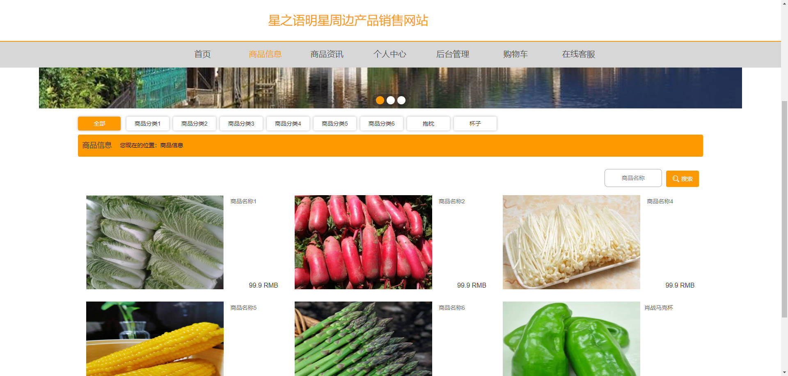
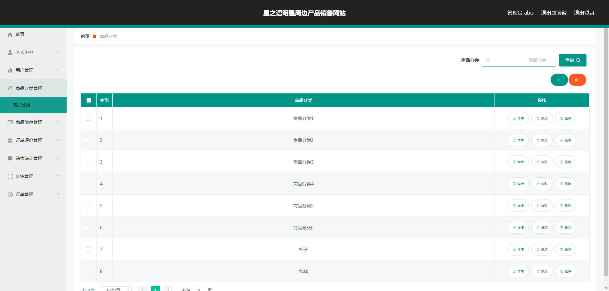

# 基于Springboot的星之语明星周边产品销售网站

## Springboot-0050


## 技术栈

Springboot mybatisplus vue mysql maven


## 数据库表(15张)


## 功能介绍

```properties
管理员功能有个人中心，用户管理，商品分类管理，商品信息管理，订单评价管理，销售统计管理，系统管理，订单管理等。用户功能有注册登录，个人中心，订单评价，我的收藏，订单管理，购买商品等。
```


## 图片

### 前台





### 后台





## 访问路径

### 前台

```properties
http://localhost:8080/springboot60m3k/front/pages/login/login.html

账号 1
密码 11
```

### 后台

```properties
http://localhost:8080/springboot60m3k/admin/dist/index.html#/login

账号 abo
密码 aboo
```


## 功能图


## 文档目录


## 打赏或交流


